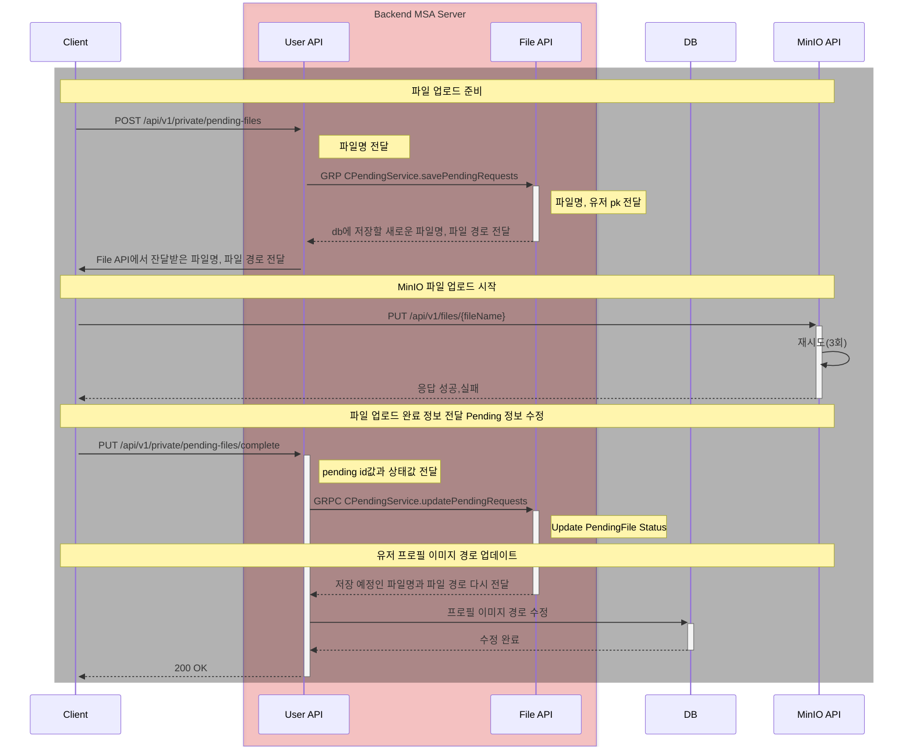

# 프로필 파일 업로드 프로세스 요약

```mermaid
sequenceDiagram
    participant Frontend as Client
    box rgba(255, 0, 0, 0.2) Backend MSA Server
        participant UserAPI as User API
        participant FileAPI as File API
    end
    participant Database as DB
    participant MinIO as MinIO API
%% 1. 파일 업로드 준비
    rect rgb(0, 0, 0, 0.3)
        Note over Frontend, MinIO: 파일 업로드 준비
        Frontend ->>+ UserAPI: POST /api/v1/private/pending-files
        Note right of UserAPI: 파일명 전달
        UserAPI ->>+ FileAPI: GRP CPendingService.savePendingRequests
        Note right of FileAPI: 파일명, 유저 pk 전달
        FileAPI -->>- UserAPI: db에 저장할 새로운 파일명, 파일 경로 전달
        UserAPI ->>+ Frontend: File API에서 잔달받은 파일명, 파일 경로 전달
        Note over Frontend, MinIO: MinIO 파일 업로드 시작
        Frontend ->>+ MinIO: PUT /api/v1/files/{fileName}
        MinIO ->> MinIO: 재시도(3회)
        MinIO -->>- Frontend: 응답 성공,실패
        Note over Frontend, MinIO: 파일 업로드 완료 정보 전달 Pending 정보 수정
        Frontend ->>+ UserAPI: PUT /api/v1/private/pending-files/complete
        Note right of UserAPI: pending id값과 상태값 전달
        UserAPI ->> + FileAPI: GRPC CPendingService.updatePendingRequests
        Note right of FileAPI: Update PendingFile Status
        Note over Frontend, MinIO: 유저 프로필 이미지 경로 업데이트
        FileAPI -->>- UserAPI: 저장 예정인 파일명과 파일 경로 다시 전달
        UserAPI ->>+ Database: 프로필 이미지 경로 수정
        Database -->>- UserAPI: 수정 완료
        UserAPI -->>- Frontend: 200 OK
    end
```