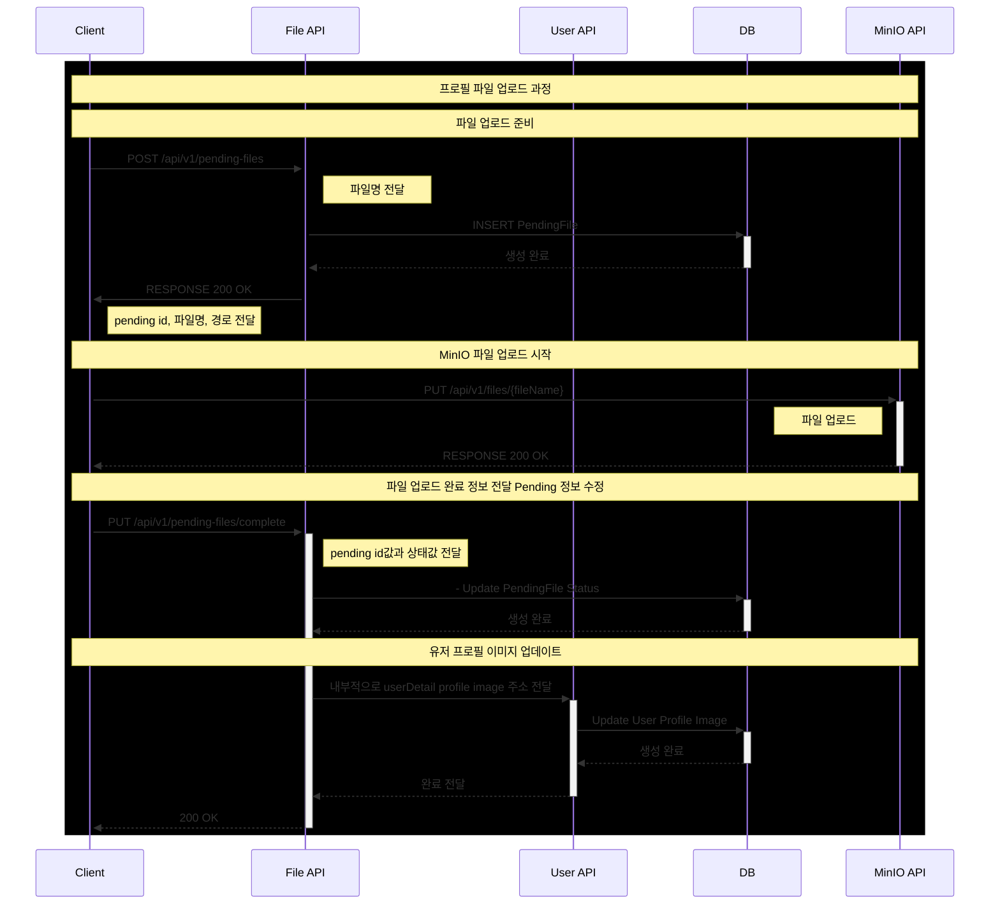

# 프로필 파일 업로드 프로세스

```mermaid
sequenceDiagram
    participant Frontend as Client
    participant FileAPI as File API
    participant UserAPI as User API
    participant Database as DB
    participant MinIO as MinIO API
%% 1. 파일 업로드 준비
    rect rgb(0, 0, 0)
        Note over Frontend, MinIO: 프로필 파일 업로드 과정
        
        Note over Frontend, MinIO: 파일 업로드 준비
        Frontend ->>+ FileAPI: POST /api/v1/pending-files
        Note right of FileAPI: 파일명 전달
        FileAPI ->>+ Database: INSERT PendingFile
        Database -->>- FileAPI: 생성 완료
        FileAPI ->>+ Frontend: RESPONSE 200 OK
        Note right of Frontend: pending id, 파일명, 경로 전달
        
        Note over Frontend, MinIO: MinIO 파일 업로드 시작
        Frontend ->>+ MinIO: PUT /api/v1/files/{fileName}
        Note left of MinIO: 파일 업로드
        MinIO -->>- Frontend: RESPONSE 200 OK
        
        Note over Frontend, MinIO: 파일 업로드 완료 정보 전달 Pending 정보 수정
        Frontend ->>+ FileAPI: PUT /api/v1/pending-files/complete
        Note right of FileAPI: pending id값과 상태값 전달
        FileAPI ->>+ Database: - Update PendingFile Status
        Database -->>- FileAPI: 생성 완료
        
        Note over Frontend, MinIO: 유저 프로필 이미지 업데이트
        FileAPI ->>+ UserAPI: 내부적으로 userDetail profile image 주소 전달
        UserAPI ->>+ Database: Update User Profile Image
        Database -->>- UserAPI: 생성 완료
        UserAPI -->>- FileAPI: 완료 전달
        FileAPI -->>- Frontend: 200 OK
    end
```